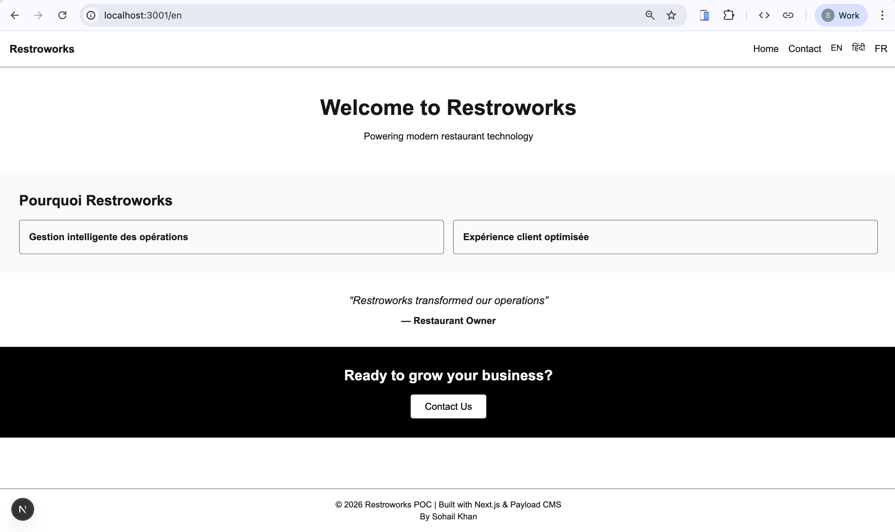
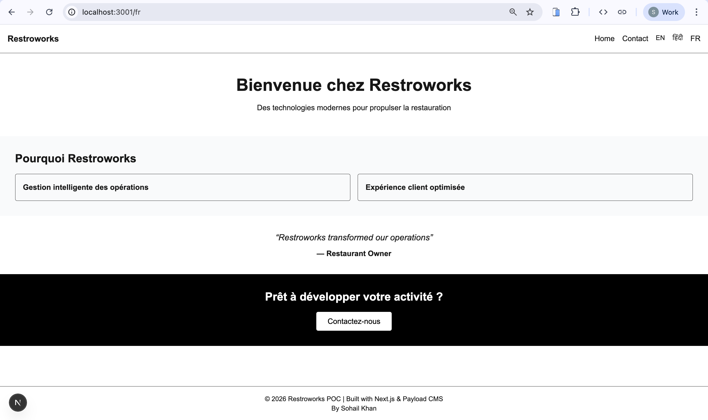
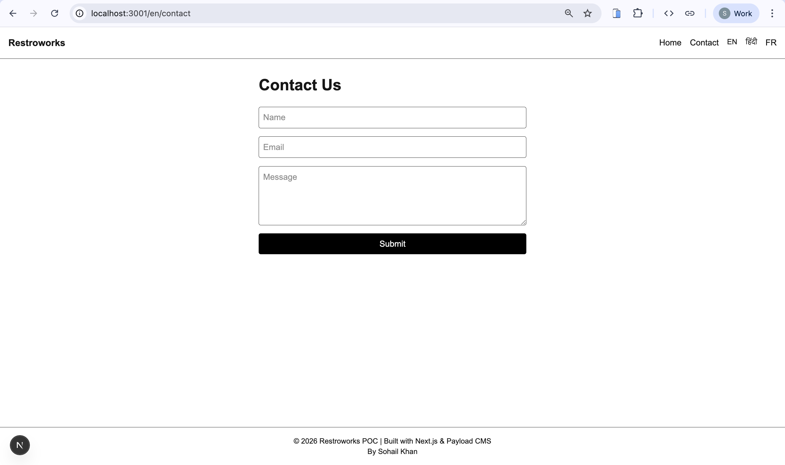
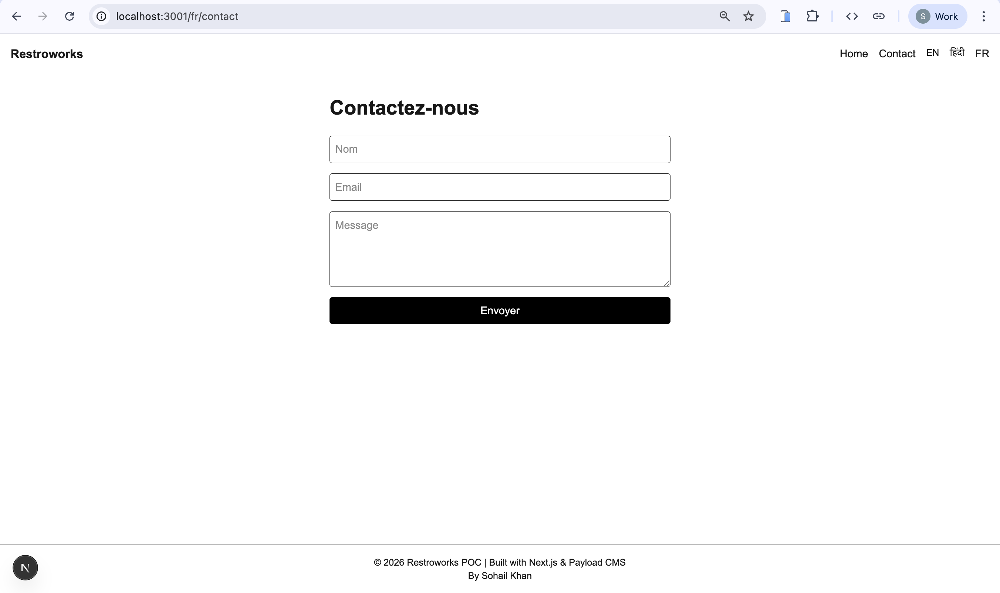
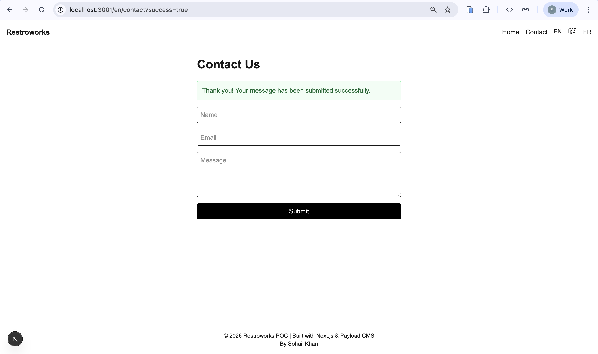
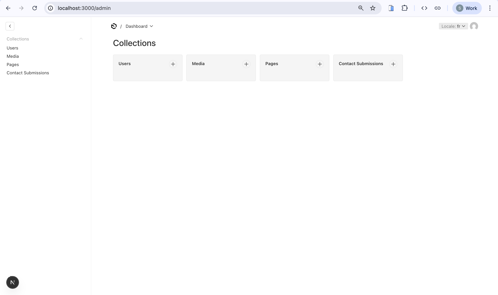
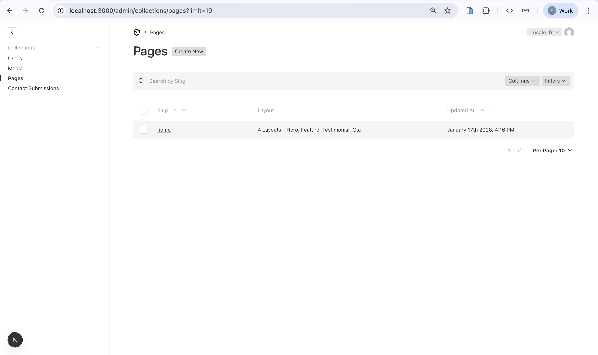
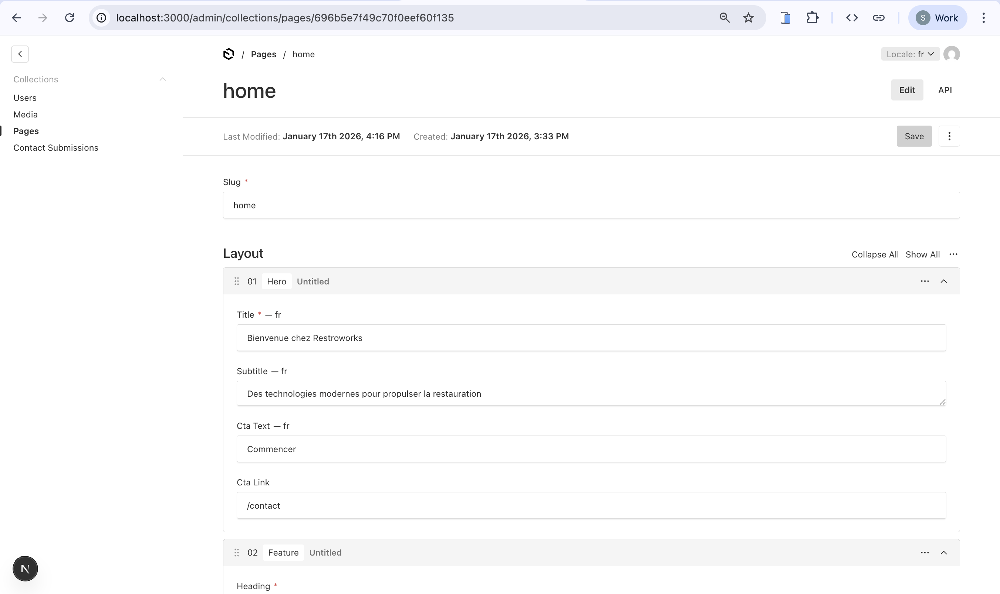
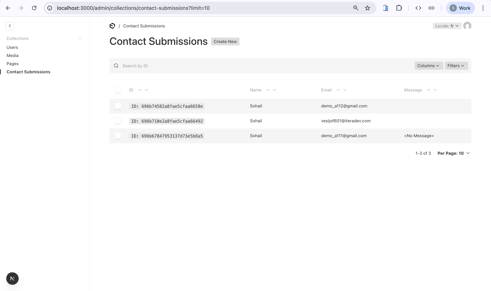

# Restroworks – Next.js + Payload CMS POC

This repository contains a **CMS-powered, multilingual, SEO-optimized website prototype** built using **Next.js (App Router)** and **Payload CMS**, as part of a Proof-of-concept.

The project demonstrates:

* Headless CMS integration
* Modular content architecture
* Multi-language support
* SEO best practices
* Clean, production-ready code structure

---

## Tech Stack

### Frontend

* **Next.js 14+ / 15+ (App Router)**
* TypeScript
* Tailwind CSS
* Server Components & Server Actions

### Backend (CMS)

* **Payload CMS**
* MongoDB
* REST API

### Optional / Tooling

* Docker (CMS)
* ESLint
* Playwright / Vitest (CMS setup)

---

## Project Structure
>tree -I "node_modules|.next|.git" -L 4

```bash
.
└── apps
    ├── cms
    │   └── payload-backend
    │       ├── src
    │       │   ├── blocks
    │       │   ├── collections
    │       │   └── payload.config.ts
    │       └── package.json
    └── frontend
        └── my-nextjs-app
            ├── app
            │   ├── [lang]
            │   │   ├── page.tsx
            │   │   └── contact
            │   │       └── page.tsx
            │   ├── layout.tsx
            │   ├── sitemap.ts
            │   └── robots.ts
            ├── components
            │   └── blocks
            ├── lib
            └── package.json
```

---

## Localization & Routing

The application uses **URL-based locale routing**:

```
/en
/hi
/fr
```

* Locale is captured using a dynamic route: `app/[lang]`
* Language switching is SEO-friendly (no cookies or client-side hacks)
* Supported locales:

  * English (`en`) – default
  * Hindi (`hi`)
  * French (`fr`)

Payload CMS localization is enabled and synced with frontend routing.

---

## CMS Modeling (Payload CMS)

### Collections

#### 1. Pages

Used to create CMS-driven pages (e.g. Homepage).

Fields:

* `slug` (unique)
* `layout` (block-based content)
* `seo` (title & description)

Public **read access enabled**.

#### 2. Contact Submissions

Stores contact form entries.

Fields:

* `name`
* `email`
* `message`

Public **create access enabled**, read restricted to admin (optional).

---

### Reusable Content Blocks

The following reusable blocks are implemented:

* **Hero** (localized)
* **Feature**
* **Testimonial**
* **CTA** (localized)

Blocks are composed dynamically on the frontend using a centralized `BlockRenderer`.

---

## Frontend Rendering Flow

1. Frontend fetches page data from Payload CMS using REST API
2. CMS returns locale-resolved content
3. Page layout is rendered dynamically block-by-block
4. CTA links are automatically prefixed with locale

This ensures:

* CMS-first architecture
* Editor-friendly content management
* Scalable page composition

---

## ✉️ Contact Form

* Implemented using **Next.js Server Actions**
* No client-side JavaScript required
* Submits data directly to Payload CMS
* Stored securely in MongoDB

---

## 🔍 SEO & Performance

Implemented features:

* Dynamic metadata from CMS (`seo.title`, `seo.description`)
* `sitemap.xml`
* `robots.txt`
* Server-side rendering
* Optimized routing
* Semantic HTML

---

## 🚀 Setup Instructions

### Prerequisites

* Node.js 18+
* MongoDB (local or Atlas)
* npm / yarn / pnpm

---

### 1️⃣ Clone Repository

```bash
git clone <public-github-repo-url>
cd <repo>
```

---

### 2️⃣ Setup Payload CMS (Backend)

```bash
cd apps/cms/payload-backend
npm install
npm run dev
```

Payload Admin:

```
http://localhost:3000/admin
```

Create an admin user when prompted.

---

### 3. Setup Frontend (Next.js)

```bash
cd apps/frontend/my-nextjs-app
npm install
```

Create `.env.local`:

```env
PAYLOAD_URL=http://localhost:3000
```

Start frontend:

```bash
npm run dev
```

Frontend runs on:

```
http://localhost:3001/en
```

# NOTE:
Add a language locale for the page to render
---

## Creating & Editing Content (CMS)

### Create Homepage

1. Go to Payload Admin
2. Pages → Create New
3. Slug: `home`
4. Add blocks (Hero, Feature, Testimonial, CTA)
5. Add SEO title & description
6. Switch locale (EN / HI / FR) and save content per language

---

## Language Switching

Language switching is done via URL:

* `/en`
* `/hi`
* `/fr`

CMS content automatically resolves based on locale.

-------------------
## 📸 Screenshots

### 🌐 Frontend – Homepage

**Homepage (English)**  


**Homepage (French)**  


---

### ✉️ Frontend – Contact Page

**Contact Form (English)**  


**Contact Form (French)**  


**Contact Submission – Success State**  


---

### 🧠 Payload CMS – Admin Panel

**Admin Dashboard**  


**Pages Collection**  


**Homepage Editor (Block-based CMS Layout)**  


---

### 📥 Payload CMS – Contact Submissions

**Stored Contact Submissions in CMS**  


---

### 🔌 API Verification

**Direct API Submission Proof**  


--------------------

## Author: Sohail Khan
Software Engineer and Developer

---